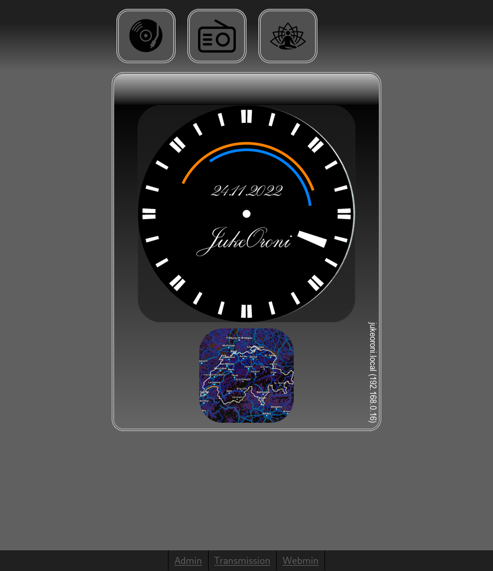

# JukeOroni

JukeOroni is a simple HiRes audio player that plays music at
up to 24bit/192kHz stored in your Google Drive - the discovery engine
expects a certain folder structure and naming convention. 
The players most important functionsality can be
controlled by the four Pimoroni Inky Impression buttons. However,
the player also features a Django powered web front end and database
administration. JukeOroni plays your music library (no meta data processing),
radio stations and is a good companion for meditation sounds library as well. 
JukeOroni also playes video files through the integrated
HDMI port so you can watch movies on your TV.

## Requires

JukeOroni runs on the following hardware:
- Raspberry Pi OS Lite (32-bit)
- [Raspberry Pi 4 Model B - 8GB (preferrably)](https://www.raspberrypi.org/products/raspberry-pi-4-model-b/)
- [Raspberry Pi IQAudio DAC Pro](https://www.raspberrypi.org/products/iqaudio-dac-pro/)
- [Pimoroni Inky Impression](https://shop.pimoroni.com/products/inky-impression)

Within a specified root directory, the folder structure for an 
album the discovery engine will look for:

`root/Artist - Year - Album [Arbitrary Tag][Arbitrary Tag][...]`

for example:

`root/Bastille - 2016 - Wild World (Complete Edition) [FLAC][16][44.1]`

Inside this folder, a `cover.jpg` or `cover.png` can be specified.
If no cover is specified, the discovery engine tries to find the
correct one on Discogs.

## Plays

The current filter settings pick these formats,
however, by adjusting the filters, MP3 and others
can be added as well to the discovery engine.
- DSF
- DFF
- FLAC
- WAV

## Looks like

### Home
The home screen shows a clock with moon phase. The clock is a 24 hours
clock that also displays sun rise/sun set (yellow) and moon rise/moon set (blue).
Beneath the clock, there is a rain radar. The clock as well as the rain radar
get updated at specified intervals. Time and sun/moon phases are based on
geo location ([set manually](https://github.com/michimussato/jukeoroni/blob/582f4d8ecdd4ece50bcb7508c921551890bdd728/player/jukeoroni/settings.py#L639)).
The JukeOroni Pimoroni screen displays the exact same content with the addition of
the button icons.

### JukeBox Albums

### Caching a specified amount of online Tracks for playback

### RadioBox

### MeditationBox

### Django Admin

